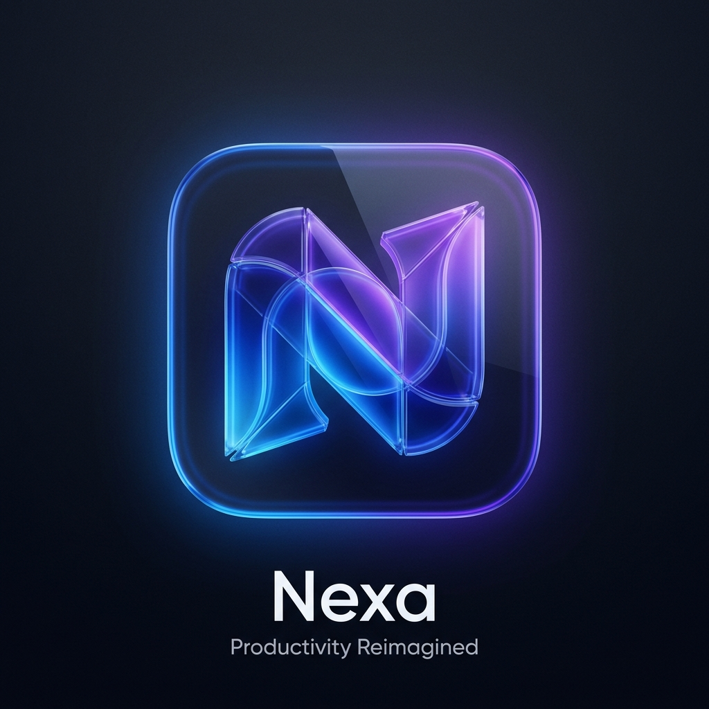
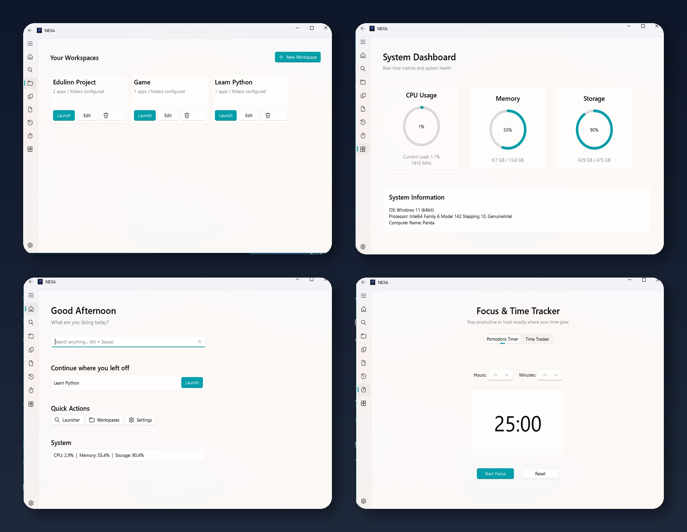

<div align="center">
  
  <h1> NEXA Productivity Hub</h1>
  <p><i>The ultimate all-in-one productivity suite for Windows, built with PyQt6 & Fluent Design.</i></p>

  
  
</div>

---

##  Features

Nexa is designed to centralize your workflow and boost your productivity through a beautiful, modern Windows 11 style interface.

-  **Workspaces:** Group your URLs, folders, and applications into distinct workspaces and launch them all with a single click.
-  **Focus Mode:** Stay in the zone with a built-in Pomodoro timer.
-  **Time Tracker:** Track exactly how much time you spend on specific tasks and projects.
-  **Clipboard Manager:** Never lose copied text again. Automatically saves your clipboard history securely in a local database.
-  **Actionable Time Machine (Activity):** A chronological timeline of your recently launched workspaces and copied texts, with quick 'Copy Again' and 'Launch Again' buttons.
-  **System Dashboard:** Monitor CPU, RAM, and Storage usage with real-time glowing progress rings.
-  **Smart Settings:** Run at startup, toggle local tracking, and clear history with a click. Supports dynamic Dark and Light themes.

## 📸 Screenshots

<div align="center">
  
</div>

##  Installation & Setup

1. **Clone the repository:**
   ```bash
   git clone https://github.com/kamranshakib/Nexa.git
   cd Nexa
   ```

2. **Set up a virtual environment (Recommended):**
   ```bash
   python -m venv venv
   .\venv\Scripts\activate
   ```

3. **Install Dependencies:**
   ```bash
   pip install -r requirements.txt
   ```
   *(If `requirements.txt` is missing, manually install: `pip install PyQt6 PyQt6-Fluent-Widgets SQLAlchemy psutil win32-setctime pywin32`)*

4. **Run the application:**
   ```bash
   python nexa/main.py
   ```

##  Privacy First
Nexa stores **everything** locally in an SQLite database on your machine (`nexa_data.db`). Your clipboard history, activities, and workspaces never leave your computer.
